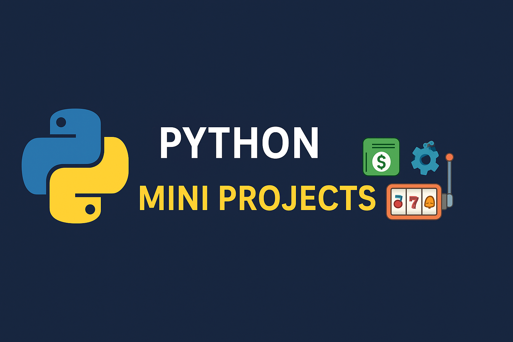

# 🐍 Python Mini Projects



Welcome to **Python Mini Projects** 🎉 — a collection of beginner-to-intermediate level projects written in Python.  
These projects are designed to help you practice programming concepts, problem-solving, and logic building in a fun way 🚀.  

---

## 📂 Projects Included

Here are the mini projects currently available in this repository:

1. 🏦 **Banking Program**  
   A simple banking system that allows you to create an account, deposit money, withdraw money, and check your balance.

2. 🎰 **Text-Based Slot Machine**  
   A slot machine simulator where you place bets, spin, and try your luck to win jackpots.

3. 🔐 **Caesar Cipher Encryption**  
   A program to encrypt and decrypt text messages using the Caesar Cipher method.

4. 🎮 **Hangman Game**  
   The classic word-guessing game where you guess letters until you find the hidden word (or run out of attempts).

5. 📅 **To-Do List Manager**  
   A text-based task manager to add

6. 🎲 **Dice Rolling Simulator**  
   Simulates rolling dice with random outcomes. Can be used for fun or board games.

7. 🎯 **Number Guessing Game**  
   A game where the computer randomly selects a number and you try to guess it with hints.

8. 📖 **Quiz Game**  
   A multiple-choice quiz program that keeps track of your score and provides feedback.

9. 🖩 **Simple Calculator**  
   A command-line calculator that performs basic arithmetic operations (addition, subtraction, multiplication, division).

---

## 🛠️ Tech Stack
- **Language:** Python 🐍  
- **Modules Used:** `random`, `math`, `datetime` (and more where needed)

---

## 🚀 How to Run

1. Clone this repository:
   ```bash
   git clone https://github.com/Priyanshu-2025/Mini-Projects.git
   ```
2. Navigate into the folder:
   ```bash
   cd Mini-Projects
   ```
3. Run any project:
   ```bash
   python <project_file_name>.py
   ```

## 💡 Future Plans
1. Add more Python projects
2. Enhance existing ones with GUI support (Tkinter / PyQt).
3. Organize them into categories (Games, Utilities, Encryption, etc.).

## 🤝 Contribution
Want to add your own mini project? Fork this repo, add your project, and create a pull request!

## 📜 License
This project is open-source under the MIT License. You’re free to use, modify, and share with proper attribution.

## 🙌 Acknowledgements
Thanks to the Python community for inspiring these fun beginner projects.  
Made with ❤️ by Priyanshu.